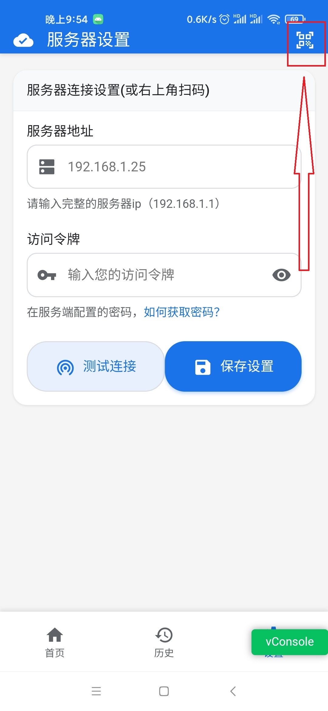
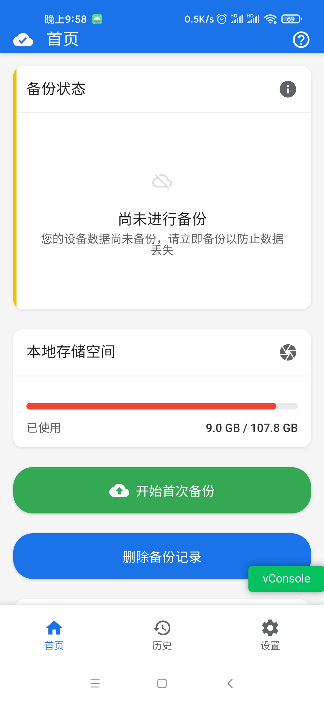

# Simple Backup - 简单备份工具

一个轻量级的备份工具，无需群晖、NAS或飞书，只需任意一台电脑即可实现文件备份。

## 特点

- 🚀 **极简部署** - 无需复杂配置，开箱即用
- 📦 **超轻量级** - 后端采用 Rust 编写，Windows 下内存占用不超过 5MB
- 🌍 **跨平台支持** - 支持多种操作系统
- 🔧 **简单易用** - 图形化界面，操作简单直观

## 技术架构

- **App 端**: Java + Vue2
- **后端**: Rust + Axum + Rbatis + SQLite

## 快速开始

### 1. 启动服务器
双击下载好的可执行文件 `simple-backup.exe`，目录下会产生一个"扫我.png"，打开图片用于后续扫码。

### 2. 配置服务器连接
点击首页第一个黄色图标，跳转到服务器设置页面，配置服务器地址和访问令牌。

### 3. 选择备份源
点击首页第二个黄色按钮，跳转到备份源管理页面，授权并选择需要备份的文件夹。

### 4. 开始备份
回到首页，点击开始首次备份，等待备份完成。

## 视频教程

[观看B站视频教程](https://www.bilibili.com/video/BV181hLzdEtG)

## 常见问题

### 备份过程中断会怎样？
应用支持任意情况的中断、暂停。未完成的备份在下次将会继续进行。

### 应用在后台会中断备份吗？
不会，只要应用没有被杀死，备份会正常进行。为了防止系统杀死进程，可以将应用加入白名单。

## 获取帮助

- [作者 GitHub 主页](https://github.com/cctyl)
- [作者 Bilibili 主页](https://space.bilibili.com/8427106)
- [源代码](https://github.com/cctyl/simple-backup)
